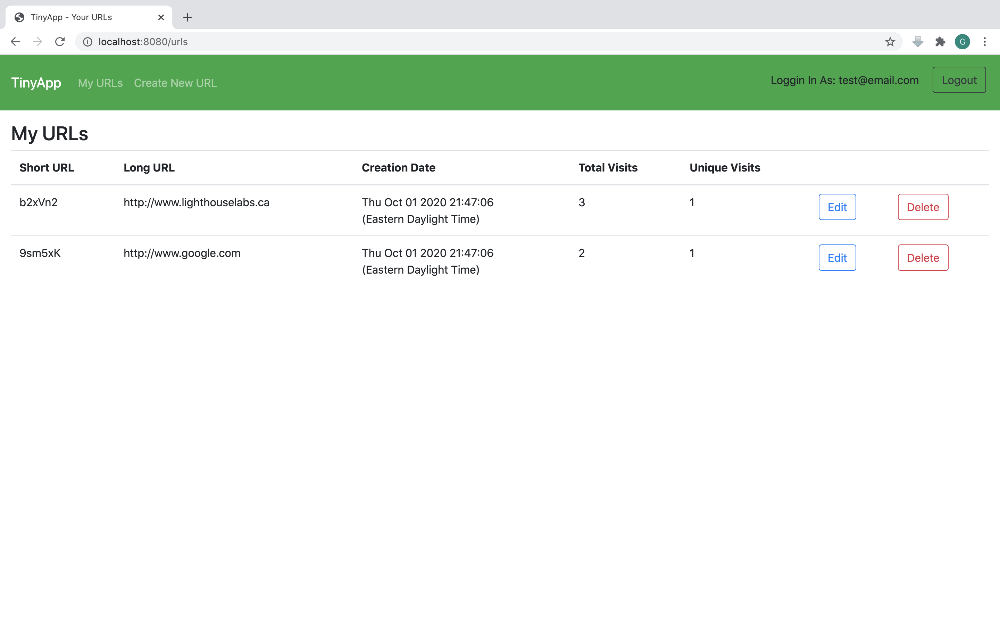

# TinyApp Project

TinyApp is a full stack web application built with Node and Express that allows users to shorten long URLs (à la bit.ly).

## Final Product

The index page will show all URLs created and owned by the user. Also shown are the creation date, total visits and unique visits.

Users can also change where the short URL points to.

## Dependencies

- Node.js
- Express
- EJS
- bcrypt
- body-parser
- cookie-session
- randomstring

## Getting Started

- Install all dependencies (using the `npm install` command).
- Run the development web server using the `node express_server.js` command.